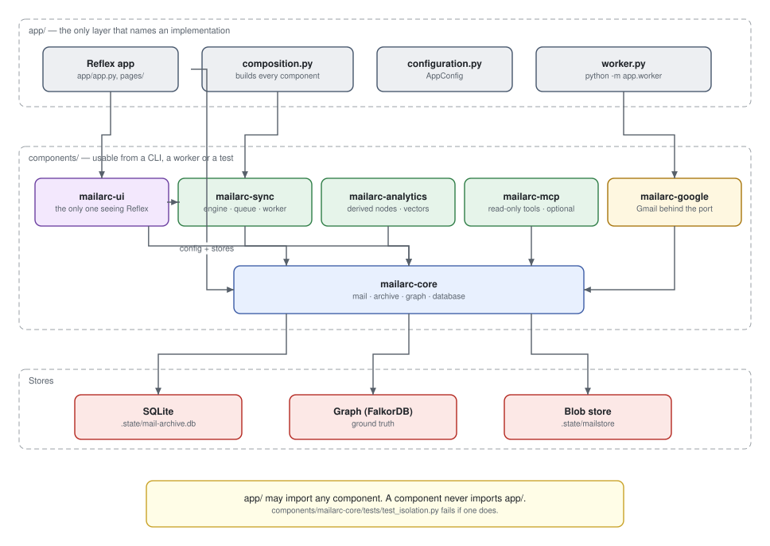

# Architecture

A uv workspace: one Reflex application on top of eight first-party components,
one of which an installation may leave out.

Three of the eight are mail providers — `mailarc-google`, `mailarc-imap`,
`mailarc-m365` — and they are siblings, not a hierarchy: none imports another,
and each hangs off `mailarc-core` alone.



## The import table is the hierarchy

| Module | May import | May **not** import |
| --- | --- | --- |
| `mailarc-core` | appkit-commons, runic.ogm, pydantic, sqlalchemy | Reflex, any provider |
| `mailarc-google` | `mailarc-core`, httpx, google-auth | `mailarc-sync`, another provider, Reflex |
| `mailarc-imap` | `mailarc-core`, imapclient | `mailarc-sync`, another provider, Reflex |
| `mailarc-m365` | `mailarc-core`, httpx, msal | `mailarc-sync`, another provider, Reflex |
| `mailarc-sync` | `mailarc-core` | any provider, Reflex |
| `mailarc-analytics` | `mailarc-core` | `mailarc-sync`, Reflex |
| `mailarc-mcp` | `mailarc-core`, `-analytics`, fastmcp | `mailarc-sync`, any provider, Reflex |
| `mailarc-ui` | `mailarc-core`, `-sync`, `-analytics`, reflex, appkit | `app` |
| `app` | everything | — |

"Another provider" is a rule with teeth now that there are three of them. A
provider may not reach into a sibling for a shared helper, so `mailarc-m365`
carries its own copy of the loopback redirect listener and of
`retry_after_seconds` — `mailarc-google` has both, and the only place they could
be shared is `mailarc-core`. Three copies is the point at which a shared home
stops being speculative.

Two rules carry it:

**`app/` may import a component. A component never imports `app`.**

**`mailarc-ui` is the only component allowed to see Reflex.** Every other one
has to stay usable from a CLI, a worker, or a test — which is what makes the
import engine testable without a browser in the room.

Neither is a convention.
[`components/mailarc-core/tests/test_isolation.py`](https://github.com/jenreh/mail-archive/blob/main/components/mailarc-core/tests/test_isolation.py)
enforces both from a subprocess, along with the ban on `runic.rag`.

One caveat about that file: it names its packages in three hand-written tuples
rather than discovering them, so `mailarc_imap` and `mailarc_m365` are not yet in
its probes. Both hold the rules today — each has an equivalent source-level check
in its own suite — but the subprocess enforcement is one edit behind reality.

## Why there is no `runic.rag`

Email already carries an exact graph in its headers — senders, recipients,
threads, labels, attachments. An LLM extraction would lay a probabilistic layer
over ground truth and make every count approximate.

So nothing writes to the archive except the import. A model reads it at query
time, through the MCP server (`mail-archive-mcp`), and never writes.

## One component is optional

`mailarc-mcp` is the only component outside the root's default dependency
closure. It sits behind an extra:

```sh
uv sync                 # 85 distributions — what the desktop bundle carries
uv sync --extra mcp     # 127 — the web deployment, MCP server included
```

`fastmcp` is around sixty distributions and a desktop archive serves no MCP, so
the bundle should not carry them. What keeps that true is one rule:
`app/mcp_server.py` is the only module under `app/` allowed to name the
component, and nothing imports *it* — `tests/test_mcp_server.py` reads every
module in `app/` and checks, because the failure would be the web application
refusing to start on exactly the installation the extra exists to produce. See
[the MCP server](./mcp-server.md).

## The composition root

[`app/composition.py`](https://github.com/jenreh/mail-archive/blob/main/app/composition.py) is the **only** module that
builds a component from configuration. States and pages ask it; they construct
nothing.

It is also the only file allowed to name an implementation:

```python
registry.register(ImapSource.DESCRIPTOR, ImapSource.using(imap_config()))
```

Everything below it asks by `MailProvider` and never learns a vendor name. That
is what keeps `mailarc-sync` from having to know the providers.

`using(config)` rather than `create`: the factory signature has no room for a
configuration object and only this module may build one, so the adapter gets it
closed over. The optional third argument is the consent runner — a browser step
between typing a credential and owning a mailbox. Gmail has one, IMAP has none,
and Microsoft 365 has one runner covering both a delegated sign-in that opens a
browser and an app-only grant that opens nothing.

### How a decision reaches the browser half

`mailarc-ui` may not import `app`, so everything the composition root decides
gets left in appkit's service registry and read back out **inside a method** —
never at import time, which would run before the registry was filled. That is
how the provider list, the archive reader, the analytics reader and the search
all arrive.

`SemanticControl` is the one entry that carries *callables* rather than a built
object, and the reason is the embedder settings page:

```python
SemanticControl(current=semantic_config, reload=load_semantic_config)
```

The effective configuration changes every time somebody saves, so a registry
entry holding the object it was handed at startup would report the embedder it
replaced; and adopting a save — re-reading the store, closing the old client,
re-publishing the search — is building a component from configuration, which
belongs here and nowhere else. Two verbs, one registry entry, and the page still
knows nothing about `app`.

Two things are cached singletons there for the same reason — a second one would
be a second answer to "which is *the* one":

- `graph_server()` — a local server is a real child process; one per caller
  would leak a `redis-server` per request.
- `sync_worker()` — a second handle would be a second child claiming the same
  jobs.
- `provider_registry()` — a list of decisions, not state.

### Two lifespans, one policy

`graph_server_lifespan` and `sync_worker_lifespan` both own their process for as
long as the application runs, and both swallow a failed start after logging it.
The page whose job is reporting server state is more useful up than down, and a
job simply waits in the queue until a worker exists.

Both `start` and `stop` are idempotent, because an ASGI lifespan can fire more
than once on reload.

### The worker is a process, not a thread

```python
WORKER_COMMAND = (sys.executable, "-m", "app.worker")
```

An import runs for hours and holds a graph session. Sharing an event loop with
the web application would make every page wait on it. And `-m app.worker` rather
than an import, because the worker's process has no business holding Reflex —
[`tests/test_worker.py`](https://github.com/jenreh/mail-archive/blob/main/tests/test_worker.py) proves it does not, from
outside, rather than trusting it.

## Inside a component

One package per capability, with fixed file roles:

| File | Holds |
| --- | --- |
| `__init__.py` | The public surface, and the docstring explaining the layering |
| `model.py` | Value objects. No I/O, no imports from anything below |
| `config.py` | The `BaseConfig` for this capability, and only its knobs |
| `ports.py` | Only once a second implementation exists |
| *everything else* | One responsibility each |

`mailarc_core.graph` is the worked example: `model` → `config` → `runtime` →
`admin` → `client` → `status` → `server`, each layer pointing only downward.

## One port, not a hexagon

There is exactly one `Protocol` in this project:

```python
class MailSourcePort(Protocol):
    provider: MailProvider

    async def verify(self) -> AccountIdentity: ...
    async def list_labels(self) -> Sequence[LabelInfo]: ...
    async def list_messages(self, cursor, *, limit) -> MessagePage: ...
    async def fetch_raw(self, refs) -> AsyncIterator[RawMessage]: ...
    async def aclose(self) -> None: ...
```

Not a `CredentialStore`, not a factory protocol, not a repository interface.
Each of those has exactly one implementation, and a port around one
implementation is indirection, not architecture.

`MailSourcePort` earns its place because there are genuinely several — four
registered today: Gmail, IMAP, Microsoft Graph, and the folder of `.eml` files
the engine tests run against. That last one is not a mock — it is registered like
any other provider, and importing a mailbox exported from Thunderbird is a real
use of it. **A second implementation from day one is what makes the port a port
rather than a description of Gmail.**

Adding the third and fourth was the test of that claim, and it passed: neither
`mailarc-imap` nor `mailarc-m365` cost a line in `mailarc-core`, `mailarc-sync`,
`mailarc-analytics` or `mailarc-ui`. See
[adding a mail provider](adding-a-provider.md) for what they did cost, and for
the places the port's shape was less obvious than it looked.

The factory beside it is a type alias, not a `Protocol`:

```python
type MailSourceFactory = Callable[[Any, str], MailSourcePort]
```

The registry needs something it can call. A one-method interface around a
callable buys nothing.

### Async on one side, blocking on the other

The port is async because a first import is tens of thousands of HTTP requests.

The runic side stays synchronous and is reached through `asyncio.to_thread`.
That is not laziness: runic's `AsyncSession` cannot lazy-load and raises
`LazyLoadError` where the blocking one simply works. The same pattern appears
wherever something blocks — `read_status` / `read_status_async`, `refresh` /
`refresh_async`, `run_consent` / `run_consent_async`.

## The anti-corruption layer

A provider's field names stop at its adapter. Gmail's JSON becomes
`mailarc_core.mail.model` value objects — frozen pydantic models — and
everything downstream sees only those.

The seam holds at the persistence boundary too. `mail_credentials.secret` is a
single encrypted, structureless column: each provider serialises its own model
into it. Adding a provider costs a registration line and **no migration**.

The same goes for `SyncCursor.token`, which the engine treats as opaque. Gmail
puts a `historyId` in it, IMAP a `UIDVALIDITY/UIDNEXT` pair, MS Graph a
`deltaLink`. The engine stores the token and hands it back, and never looks
inside — which is what keeps the port from growing a provider-shaped hole.

## Value objects are pydantic, always

Never `@dataclass`. Immutable ones carry `model_config = ConfigDict(frozen=True)`.

This includes Reflex state var types: Reflex serialises a `BaseModel` and
resolves `row.field` inside `rx.foreach`. A SQLAlchemy row must never become a
state var — a row whose session has closed hands back nothing, so every row is
projected onto a frozen model on the way out of the session.

## Reading further

- [Data model](data-model.md)
- [The import pipeline](import-pipeline.md)
- [Jobs and the worker](jobs-and-worker.md)
- [Adding a mail provider](adding-a-provider.md)
