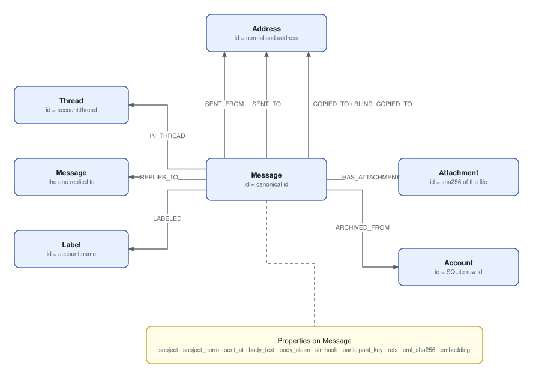
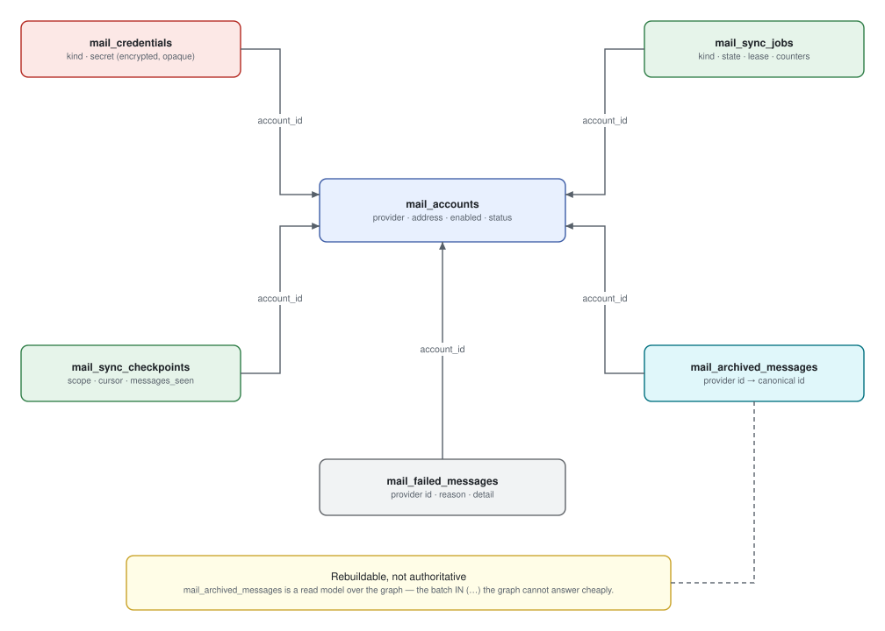

# Data model

Three stores, with a clean split of responsibility.

| Store | Holds | Rebuildable |
| --- | --- | --- |
| **Graph** | What a message *is* | From the blob store |
| **SQLite** | What we have *done* | Partly — the ledger, yes; accounts and credentials, no |
| **Blob store** | The original bytes | No. This is the archive |

## The graph — ground truth



The solid boxes are ground truth. The two dashed frames are the other two
layers, and they are described in the two sections below: the annotation layer
holds what a person decided, and the derived layer holds what an analysis
worked out.

Written by exactly one module:
[`mailarc_core.archive.writer`](https://github.com/jenreh/mail-archive/blob/main/components/mailarc-core/src/mailarc_core/archive/writer.py).
An analysis may read all of it and add nodes of its own beside it, but it never
edits what a provider actually sent. That separation is what makes a wrong
analysis a rerun instead of a restore.

Every property is read out of the message or computed from it deterministically,
so re-parsing the same bytes gives the same node.

### Nodes

| Node | Key | Why that key |
| --- | --- | --- |
| `Message` | canonical id | One node however often the mail arrives |
| `Address` | normalised address | `Bob@Example.COM` and `bob@example.com` are one human |
| `Thread` | `{account}:{thread_id}` | Two providers hand out thread ids from their own namespaces |
| `Label` | `{account}:{name}` | Always the provider's own label — a guess never becomes one |
| `Attachment` | sha256 of the file | The same file on twenty messages is one node |
| `Account` | SQLite row id | Ties a graph copy back to the mailbox it came from |

A `Thread`'s key names one of three things, tried in that order: the provider's
own thread id, the root of the message's `References` header, or — when it has
neither — the message's own `Message-ID`. The third case is what makes an IMAP
conversation whole. A conversation's first message carries no `References` and
no `In-Reply-To`, so it used to get no thread at all while its own replies
grouped together without it; it opens a conversation of its own instead, keyed
on the id those replies will name. The cost is one `Thread` node and one
`IN_THREAD` edge per standalone message. A message with no `Message-ID` still
gets nothing: its canonical id is a digest of the bytes, which no reply can
ever reference.

`Address.display_names` is a **list**, because the same address signs itself
differently in every message it sends. The writer appends a name it has not seen
before by *assignment*, not in-place mutation — runic tracks dirtiness through
the descriptor, so a mutated list would never reach the graph.

**Seven properties on these nodes are declared here and written elsewhere.**
`Message.embedding` / `embedding_model` belong to the semantic phase;
`Message.importance` / `importance_reasons` / `importance_version` and
`Address.rank` / `rank_version` belong to the analytics rebuild, which nulls
them and computes them again on every run. The import writes none of them —
that is exactly why the writer never overwrites an existing node — and a query
needs the declaration before it can filter on the property at all. They are
disposable in a way nothing else on these nodes is, and `None` means "never
computed", which is not a low score. The delete guards are untouched by any of
it: a `SET … = NULL` reaches no node it did not name.

### Why a derived number may sit on a ground-truth node

`Message.importance` is written by `mailarc-analytics` onto a node
`mailarc-core` owns, which looks like the layering being broken and is not. It
is `Message.embedding`'s arrangement exactly, and the four conditions that made
that one acceptable all hold:

- **The import never writes it.** Nothing a provider sent is overwritten,
  because nothing a provider sent is involved.
- **It is versioned.** `importance_version` and `rank_version` carry the
  scoring run that produced the number, so a message still wearing the old
  string is one this rebuild did not reach rather than one that scored the
  same.
- **It is nulled and computed again**, in the rebuild's own delete stage, which
  is what makes an analysis bug cost one run.
- **The delete guards never see it.** A property is neither a node nor an edge,
  and a `SET … = NULL` removes nothing.

The alternative was a `Score` node with an edge to every message, which is one
node and one edge per message in the archive to hold one float. The reason to
keep a derived property off ground truth is that it could be mistaken for
something the sender wrote, and a name that says `importance_version` cannot
be.

### Edges

| Edge | From → to | Carries |
| --- | --- | --- |
| `SENT_FROM` | Message → Address | |
| `SENT_TO` | Message → Address | |
| `COPIED_TO` | Message → Address | |
| `BLIND_COPIED_TO` | Message → Address | |
| `IN_THREAD` | Message → Thread | |
| `REPLIES_TO` | Message → Message | |
| `LABELED` | Message → Label | |
| `HAS_ATTACHMENT` | Message → Attachment | `filename`, `content_id`, `inline` |
| `ARCHIVED_FROM` | Message → Account | `provider_message_id`, `provider_thread_id`, `folder`, `uid`, `archived_at` |

Four separate edge types for the recipient roles rather than one edge with a
`role` property: RFC 5322 closes the set, so the co-recipient query walks them
without a property filter. `SENT_FROM` rather than `FROM`, because `FROM` is
awkward in several Cypher dialects.

`ARCHIVED_FROM` is where the anti-corruption layer shows up in the graph. The
same mail reaching two accounts is *one* `Message` node with two edges, so
everything that differs between the two copies — the provider's id, the folder,
the labels — sits on the edge or on the account, never on the message.

### The five analysis-bearing fields

Computed once, at import time, in
[`mail/parsing.py`](https://github.com/jenreh/mail-archive/blob/main/components/mailarc-core/src/mailarc_core/mail/parsing.py):

| Field | What it is |
| --- | --- |
| `subject_norm` | Reply prefixes and ticket tokens gone, lowercased, whitespace collapsed |
| `participant_key` | sha256 over the sorted set of everyone on the message |
| `simhash` | 64-bit SimHash over word shingles of `body_clean` |
| `refs` | Ticket tokens pulled out of the subject and the body |
| `body_clean` | The body without quoted predecessors, sign-off and legal footer |

Everything downstream trusts that parsing already did this. Nobody re-reads a
header later.

**`body_text` and `body_clean` are both needed and are not interchangeable.**
`body_text` is the full text and feeds full-text search. `body_clean` is what
gets hashed and embedded. Skip the cleaning and every message sharing a company
footer hashes alike, and the template analysis returns noise.

The cleaning rules are blunt heuristics over German and English conventions —
a reply intro, a `>` quote, a `--` separator, a sign-off, a legal boilerplate
opener. They cut a little too much rather than too little: a lost sentence costs
recall, a kept footer costs correctness.

### The SimHash sign problem

A SimHash uses all 64 bits. Every Cypher backend's integer is *signed* 64-bit,
so half of all messages carry a value the graph cannot hold.

`to_signed_64` / `to_unsigned_64` reinterpret via two's complement. The bit
pattern survives, which is all the template analysis needs — it compares Hamming
distances, never magnitudes.

### Canonical identity

```text
normalise(Message-ID)                                  when the sender sent one
sha256:<hash of  sent_at | from | subject | sha256(body)>   when they did not
```

The contract: importing the same mailbox twice creates zero new nodes and zero
new edges. That only works if the id comes from the *message*, not from the
provider.

RFC 5322 says a `Message-ID` is globally unique, so it wins whenever there is
one. Normalising it lowercases the domain half and keeps the local part's case —
RFC 5322 says the local part is significant there, unlike in an address, where
every real mail system disagrees.

The fallback hashes the *decoded* body, not the raw MIME part: a relay that
re-encodes quoted-printable as base64 changes the bytes on the wire but not the
text, and the id must survive that.

### Indexes

Declared on the model, created by `runic.migrate` — the `index` and `index_type`
arguments are declarations only.

```python
op.create_range_index(
    "Message", prop
)  # sent_at, subject_norm, simhash, participant_key
op.create_range_index("Address", "domain")
op.create_constraint("UNIQUE", "NODE", "Message", ["rfc_message_id"])
op.create_fulltext_index("Message", "subject", "body_text")
```

Two gotchas the baseline migration records:

- `create_constraint` creates its own index unconditionally, and FalkorDB
  rejects a second `CREATE INDEX` on an indexed attribute. So `rfc_message_id`
  gets no explicit range index — asking for both fails the migration.
- One full-text index covers **both** properties. The archive searches them
  together, and FalkorDB keeps one such index per label.

The vector index on `Message.embedding` is deliberately **not** in the baseline:
nothing wrote embeddings before phase 6, and an HNSW index costs memory from the
day it exists. Revision `5f4678dfc5a4` adds it — 768 dimensions, cosine, `M=16`,
`efConstruction=400`, `efRuntime=512` — and those five numbers are read back off
a running server by `tests/test_graph_migrations_vector_local.py`, because a
wrong one does not raise. FalkorDB accepts a vector of any other length, stores
it and silently declines to index it, so a job against a mismatched index
reports every message embedded and no search finds one. `efRuntime` cannot be
overridden at query time, which is why the migration's literal is the only
chance to set it: runic's default of 10 measured 14 % recall@10 where 512
measured 99 %.

The second revision adds the three the derived layer needs, and one on the
ground truth:

```python
op.create_range_index(label, "id")  # Group, Topic, Template
op.create_range_index("Message", "id")
```

Range indexes, not unique constraints, although each of those keys is unique by
construction. A constraint is checked on every write to the label, and these
nodes are deleted and rewritten wholesale on every rebuild — so it would charge
for a guarantee the id already gives. Without any index, though, each of the
`MERGE (:Group {id: ...})` statements a rebuild issues scans every node wearing
that label, and a rebuild issues one per finding.

`Message.id` is there for the read rather than the write. The baseline indexed
the four properties the analyses *filter* by and left the primary key alone,
because nothing walked the archive in id order until the derived reader did:
it pages the ground truth with `WHERE m.id > $after ... ORDER BY m.id`, which
is an index seek with the index and a full sort of every message without it,
once per page.

The fourth revision (`3824f164c0a6`) adds the annotation layer's one guarantee
and the two indexes the scoring phase reads through:

```python
op.create_constraint("UNIQUE", "NODE", "Tag", ["id"])
op.create_range_index("Message", "importance")
op.create_range_index("Address", "rank")
```

A constraint here and a range index for the derived labels, and the difference
is the write pattern. A derived id is a hash of its own contents and the nodes
are rewritten wholesale on every rebuild, so a constraint would charge per write
for a guarantee the id already gives. A `Tag` is written by hand a few times a
day, and `TagRepository.create`'s lookup is not a guarantee — two sessions can
both find nothing and both write, and one project's mail would end up split
across two nodes no listing could tell apart.

Same trap as the baseline, and the downgrade is where it bites: the constraint
creates its own range index on `Tag.id`, `GRAPH.CONSTRAINT DROP` does not remove
it, and dropping the index first is refused with "Index supports constraint". So
the downgrade drops the constraint and *then* the index, and
`tests/test_graph_migrations_annotation_local.py` upgrades, downgrades and
upgrades again against a running server to prove the order works.

`Message.importance` and `Address.rank` are indexed before anything writes them,
which costs an empty structure and buys the ordering every insights listing
does. They are declared on the models now for the reason the vector index makes
elsewhere: the migration and the writer have to agree about the names, and a
disagreement shows up as a slow page rather than as an error.

### A declaration-order trap

Class order in `archive/model.py` is load-bearing. runic resolves a node's
annotations *at declaration time*, so every type an annotation names has to
exist already.

`Message.replies_to` points at `Message`, which is not bound while the class
body is still running. It is therefore annotated `Any`, with the real type in
`target=`. A forward reference there does not merely fail for that field — it
aborts the whole resolution pass and **silently strips the datetime and vector
converters off every other field on the node**.

## The graph — annotations

Between the two, and belonging to neither: what a *person* wrote down about the
archive. Written by exactly one module —
[`mailarc_core.archive.tags`](https://github.com/jenreh/mail-archive/blob/main/components/mailarc-core/src/mailarc_core/archive/tags.py)
— and read by everything.

| Element | Key / carries | Written by | Removed by |
| --- | --- | --- | --- |
| `Tag` | `tag:<slug>` (UNIQUE), `name`, `color`, `origin`, `created_at` | `TagRepository.create` | `TagRepository.delete`, and nothing else |
| `TAGGED` Message → Tag | `source` (`manual`/`accepted`/`auto`), `at` | `TagRepository.tag_messages` | `untag`, or the message's own purge |
| `Address.remote_trusted` | — | `AddressRepository.trust_remote` | nobody |

An annotation is a standing decision, so it lives on the same side of the line
as `Address.remote_trusted` and not beside the derived nodes. Concretely:

- **A rebuild cannot reach it.** The delete statements in the query catalogue
  are pinned to the derived labels at import time, and `Tag` is not one of them.
- **A mailbox clear-out leaves it standing.** The `TAGGED` edges to messages
  that mailbox was the sole holder of go with those messages — that is what
  `DETACH DELETE` on a message means — so a tag can end up with a count of
  zero. That is a tag whose mail is gone, not a bug, and the listing shows it so
  it can be deleted on purpose.
- **An analysis suggests, a human decides.** `mailarc-analytics` may match a
  `Tag` and writes `SUGGESTED` edges pointing at one; it never writes or
  removes a `TAGGED` edge. The catalogue test lists `Tag` among the labels a
  derived statement may never `MERGE`.

The key is derived from the name, not generated: two people naming the same
project the same way get one tag. That is also why a rename does **not** re-key
the node — the id is what every membership points at, and moving it would
orphan the lot.

Two traps the module records, both measured:

- `untag` is `DELETE r` on the relationship variable and never `DETACH DELETE`,
  and the id predicate has to stand **before** the delete. runic emits a
  predicate naming a traversed variable after the whole pipeline, so the naive
  spelling empties the tag and reports the right number while doing it. A
  `WITH r, m` stage pulls it back in front, and an exact shape is matched at
  import time — the same device `archive/purge.py` uses.
- Clearing a colour needs an explicit `SET t.color = NULL`. runic's dirty
  tracking encodes only properties that *have* a value, so `node.color = None`
  followed by a flush emits a `SET` that never mentions the colour.

## The graph — derived

Written by exactly one module in the other direction:
[`mailarc_analytics.derived`](https://github.com/jenreh/mail-archive/tree/main/components/mailarc-analytics/src/mailarc_analytics/derived).
Everything here is an *answer*, not a fact, and every node is disposable —
`task graph:rebuild-derived` deletes all of it and computes it again. An
analysis bug therefore costs one run, never a restore.

### Nodes

| Node | Key | Holds |
| --- | --- | --- |
| `Group` | `participant_key` | `size`, `message_count`, `first_seen`, `last_seen` |
| `Topic` | `topic:<sha256 of its members>` | `label`, `method`, `score`, `message_count`, `keywords`, `first_seen`, `last_seen` |
| `Template` | `template:<simhash>:<direction>` | `sample_text`, `occurrences`, `automation_score`, `direction`, `first_seen`, `last_seen` |
| `Community` | `community:<sha256 of its members>` | `size`, `message_count`, `label`, `method`, `first_seen`, `last_seen` |

The keys are hashes of the finding's own content, not ULIDs as first sketched.
A generated id would be new on every rebuild, which makes "run it twice and
nothing changes" unprovable — the whole derived layer would churn on each run
even when the archive had not moved.

`Community` is a partition of the co-addressing graph, produced by
`algo.labelPropagation` over `Address` and `CO_ADDRESSED`. Its key is a digest
of its members for a second reason on top of the one above: FalkorDB's label
propagation takes **no seed**, so two runs over an unchanged graph can label an
ambiguous node differently. Keying on the members means a changed partition
writes a differently-keyed node rather than renaming one, and
`community_max_iterations` is pinned rather than left to the procedure's own
default so that there is less for the key to absorb.

`Community.label` is the commonest domain among its members, with the tie going
to the domain of the best-ranked member. A domain is a name a human recognises
and a name nobody invented, which is the rule about what may appear on a
derived node.

`Topic.keywords` is a list of terms, not a node. The words that occur often in
one topic and rarely across the others, worked out with plain TF-IDF over the
topics. It sits on the node because it describes that one topic and nothing
else, so a `Keyword` node shared between topics would claim a relationship the
counting never established.

### Edges

| Edge | From → to | Carries |
| --- | --- | --- |
| `CO_ADDRESSED` | Address → Address | `count`, `first_seen`, `last_seen` |
| `ADDRESSED_GROUP` | Message → Group | |
| `ABOUT` | Message → Topic | `score`, `method` |
| `INSTANCE_OF` | Message → Template | `distance` |
| `MEMBER_OF` | Address → Community | `rank` |
| `IN_CIRCLE` | Message → Community | `score`, `method` |
| `SUGGESTED` | Message → Tag | `score`, `method` |

`CO_ADDRESSED` is undirected in meaning and directed in storage. FalkorDB
refuses an undirected `MERGE`, so the pair is ordered before it is written —
smaller id first, enforced by `CoAddressedPair` — and that ordering is what
makes one pair one edge instead of two. Which way round an edge ended up stored
is still an accident of who was written to first, so every read matches it
without an arrow. Bcc'd addresses are
deliberately left out of it: a blind copy was written to *without* the other
recipients knowing, and an edge saying otherwise would be wrong about the one
thing Bcc means.

`ABOUT.method` is what keeps a suggestion from hardening into a fact. A
`method="ref"` cluster was drawn by a ticket token both messages carry; a
`method="embedding"` cluster is a guess — a nearest-neighbour pair above
`app_semantic_topic_similarity_min`, offered only where the six exact signals
left two messages unconnected, and only on an installation with an embedder
configured. It stays a
plain string rather than an enum on purpose — a graph written by a newer build
has to keep decoding in an older one.

`MEMBER_OF.rank` is the *archive's* centrality and not the circle's. It is the
number the centrality stage wrote to `Address.rank`, copied onto the edge so
that a subgraph read can size a node without a second hop to the address. That
copy is also why the stage order puts centrality before communities: a
`MEMBER_OF` written before the ranks exist carries a null and nothing
recomputes it.

`IN_CIRCLE.score` is the share of a message's participants who are members of
the circle, so a mail to one member and nine strangers scores 0.1. A message
joins **at most one** circle, the one with the largest share and the smaller id
on a tie, because "which circle is this mail in" has one answer or none.

`SUGGESTED` is the one derived edge that touches the annotation layer, and it
only ever *points* at it. `TAGGED` is a person's decision and is written by
`mailarc_core.archive.tags` alone; a `SUGGESTED` edge is recomputed and deleted
with every rebuild. Its two properties are the argument a reader sees before
accepting one: `score` is how strong the case is, and `method` is which kind of
group made it (`thread`, `topic` or `community`).

### A derived node never becomes ground truth

`Label` comes from the provider, `Topic` comes from us, and nothing merges them.
A user may promote a `Topic` into a real `Label`; there is no way back. The
delete statements in the query catalogue are pinned to that rule at import time
— [`rebuild.py`](https://github.com/jenreh/mail-archive/blob/main/components/mailarc-analytics/src/mailarc_analytics/derived/rebuild.py)
matches each of them against an exact shape and refuses to import if one has
been edited into something that could reach a `Message`.

There are eight of them now, in four shapes:

| Statements | Shape they have to have |
| --- | --- |
| `DELETE_GROUPS`, `DELETE_TOPICS`, `DELETE_TEMPLATES`, `DELETE_COMMUNITIES` | `MATCH (n:Group\|Topic\|Template\|Community) … DETACH DELETE n` |
| `DELETE_CO_ADDRESSED` | `MATCH (a:Address) MATCH (a)-[r:CO_ADDRESSED]->(b:Address) … DELETE r` |
| `DELETE_SUGGESTED` | `MATCH (t:Tag) MATCH (t)<-[r:SUGGESTED]-(m:Message) … DELETE r` |
| `CLEAR_IMPORTANCE`, `CLEAR_ADDRESS_RANKS` | `SET … = NULL`, with no `DELETE` in it at all |

The alternation of labels is written out rather than left open, so a new
derived label is a visible edit to a guard and a label that is not derived has
no way in.

`SUGGESTED` gets a shape of its own rather than a second alternation in the
co-addressing one, because the two are not the same risk. `CO_ADDRESSED` runs
between two addresses, which an import could write again. `SUGGESTED` runs from
a `Message` to a **`Tag`**, and a tag is the one thing in this graph that no
re-import could restore, because nothing outside the graph ever held it. So the
statement is rooted at the tag purely in order to walk off it, deletes the
relationship variable and never the node one, and `DELETE t` is one character
away from emptying the annotation layer.

The rooting is also a runic constraint rather than a style choice. runic emits
a predicate naming a *traversed* variable after the whole pipeline, so walked in
from the message end the batching `WITH` lands behind the `DELETE` it was meant
to bound. The guard pins the working order rather than trusting it.

### The statements the query builder cannot express

runic 0.6 cannot start a statement with `CALL`. `select()` always opens with
`MATCH (n:Label)` and `.call()` is a mid-pipeline clause, so the nearest a
builder gets to `CALL algo.pageRank(...)` is
`MATCH (m:Message) CALL algo.pageRank(...)`, which asks the store to run a
whole-graph algorithm once per matched message.

So six statements in
[`queries/statements/algorithms.py`](https://github.com/jenreh/mail-archive/blob/main/components/mailarc-analytics/src/mailarc_analytics/queries/statements/algorithms.py)
are raw Cypher literals. Together with the vector index read they are the only
statements in the catalogue that are not builder objects.

| Statement | Calls | Answers |
| --- | --- | --- |
| `PROCEDURES` | `dbms.procedures` | Which procedures this store has. The capability probe |
| `LABEL_PROPAGATION` | `algo.labelPropagation` | The partition `Community` is built from |
| `MESSAGE_PAGERANK` | `algo.pageRank` | Reply centrality over `REPLIES_TO` |
| `ADDRESS_BETWEENNESS` | `algo.betweenness` | Bridges between circles. Off by default |
| `SHORTEST_PATHS` | `algo.SPpaths` | How two addresses are connected, for the explorer |
| `NEIGHBOURHOOD` | `algo.BFS` | What is around one message, for the explorer |

Four rules hold for all six.

**A caller's value can only arrive as a bound `$parameter`.** Every one is a
plain literal with no f-string, no `%` and no `.format` anywhere near it, and
the catalogue's AST test asserts that over the string entries as well as the
builder ones.

**Every statement projects scalars, never a node.** `YIELD node` binds a graph
entity, and `rows_of` zips the driver's own value shapes into a row, so a bare
`RETURN node` would hand a `falkordb.node.Node` to a value object that wanted
an id. `node.id AS id` is the shape on all of them.

**A misspelled property is no longer a type error, so a test takes that job.**
`tests/queries/test_queries_catalog_local.py` binds every entry's parameters and
runs the lot against the vendored FalkorDB, the procedures included, against a
graph planted with the labels and relationship types they name.

**The procedures throw on a graph that has not been analysed.** Measured on the
vendored FalkorDB 4.20.3, `algo.labelPropagation` over a label or a relationship
type the graph does not hold raises `ResponseError`, which is exactly the state
a fresh archive is in before the first `CO_ADDRESSED` merge. `algo.pageRank` is
the odd one out and answers with no rows. So every caller runs the probe first,
catches `ResponseError` around each call, and counts what it stepped over in
`DerivedCounts.algorithms_skipped`. A skipped stage reports zero and the rebuild
carries on.

Two things this backend does that a reader would not guess, both measured
rather than assumed. `algo.pageRank` takes two **positional** arguments,
`('Message', 'REPLIES_TO')`, and refuses the configuration map its siblings
take. `algo.betweenness` refuses a sampling size of zero, which is why
`betweenness_sampling` means "skip the call" at zero rather than "sample
nothing".

## The relational store



Six tables, in
[`database/entities.py`](https://github.com/jenreh/mail-archive/blob/main/components/mailarc-core/src/mailarc_core/database/entities.py).

| Table | Holds |
| --- | --- |
| `mail_accounts` | Which mailbox we sync, and where it stands |
| `mail_credentials` | What opens it, encrypted, opaque |
| `mail_sync_checkpoints` | How far a scope got, so the next run resumes |
| `mail_sync_jobs` | One unit of work a worker claims and reports on |
| `mail_archived_messages` | Provider ids already archived — a read model |
| `mail_failed_messages` | What we gave up on, and why |

Every enum-ish column is a short string, not a database enum. Adding a provider,
a job kind or a status is then a code change and never a migration.

### `mail_archived_messages` is a read model

It exists for exactly one query: *"of these hundred provider ids, which do I
already have?"*

The graph cannot answer that cheaply for a batch; a relational `IN (…)` can, in
one statement per listing page. Nothing but speed lives here, which is why the
table stays discardable — it can be rebuilt from the graph at any time.

Its `canonical_id` column is `Text` rather than a sized `VARCHAR`, on purpose: a
canonical id is either a normalised `Message-ID`, whose length nobody but the
sender controls, or the 71-character `sha256:` fallback. Any width small enough
to look tidy is one a real mailbox eventually overflows. SQLite ignores the
length anyway; PostgreSQL would have raised on the first message that arrived
without a `Message-ID`.

### `mail_failed_messages` is the other half of the ledger

Skipping is allowed. Silence is not. Every message the import drops leaves a row
here, so a permanent failure is countable rather than invisible.

There is no `except: pass` anywhere in the import path, and no place one would
fit — a `MailPermanentError` becomes a *value* that travels the same queue as a
success, and the same consumer writes both.

### SQLite specifics

`appkit_commons` exposes exactly one `DatabaseConfig.url` and hands it to both
the sync and the async engine. The application only ever opens async sessions,
so the configured URL names `aiosqlite`; Alembic and Reflex's `db_url` ask
`sync_database_url()` for the pysqlite variant.

Three pragmas are not optional:

| Pragma | Without it |
| --- | --- |
| `journal_mode=WAL` | A reader blocks on a writer |
| `foreign_keys=ON` | SQLite **silently ignores** `ON DELETE CASCADE` |
| `busy_timeout=5000` | A second writer raises `database is locked` |

They are registered on the SQLAlchemy `Engine` class, not on one engine.
appkit builds the sync and async engines lazily behind its own caches, and
Reflex builds a third — all against the one SQLite file this application owns.

## The blob store

Content-addressed and write-once. The file name *is* the sha256 of what is in
it.

```text
.state/mailstore/ab/cd/abcd…ef.eml
.state/mailstore/12/34/1234…56.bin
```

Two levels of fan-out by the first two byte pairs, so a million messages spread
over 65 536 leaf directories instead of one unlistable one.

Every write goes to a temporary file **in the destination directory** and lands
with `os.replace`. Same directory, because a rename is only atomic within one
filesystem and the system temp directory is routinely a different one. `fsync`
before the rename, so what lands is the whole content and not the empty file the
page cache had not written yet.

Nothing here ever overwrites: identical content means an identical name, and
different content cannot land on the same name. Write-once is not an
optimisation — it is the guarantee that a retried import cannot change what is
already on disk.

**Keeping the whole `.eml` matters more than it looks.** The graph holds a
capped, parsed rendering of a message; the bytes on disk are the message. A
parser fix can be replayed over the entire archive from here without asking a
provider for anything twice.
