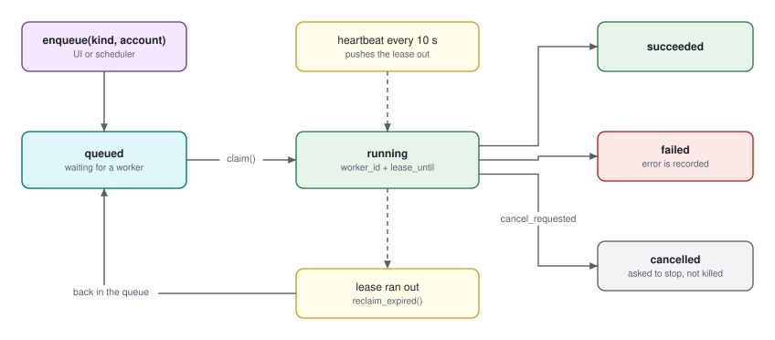

# Jobs and the worker

An import runs for hours and a laptop lid closes. So progress is a **row**, not a
stack frame: a job is claimed under a lease, reports what it got done, and — if
the worker dies — is taken over by the next one at the checkpoint the dead one
wrote.



## Why not the appkit scheduler

It was measured against this and does not fit. It is a cron with a trigger, not
a work queue with a lease, and it silently falls back to an in-memory scheduler
on anything but PostgreSQL. Hence a table of our own.

`JobQueue` is deliberately **not** a scheduler either. There is no trigger, no
cron and no calendar in it. Something else decides *when* a job should exist;
this decides who gets to run it and what happened.

## The state machine

```text
queued ──claim──> running ──> succeeded
                     │└──────> failed      (with error)
                     └───────> cancelled   (cancel_requested)
```

Plus one edge back: a lease that stops moving returns `running` to `queued`.

## The claim is a compare-and-swap

```python
UPDATE mail_sync_jobs
   SET state='running', worker_id=?, lease_until=?, heartbeat_at=?, ...
 WHERE id=? AND state='queued'
```

`rowcount` decides who won. SQLite has no `SKIP LOCKED` and does not need one —
a compare-and-swap lets exactly one worker through, and the loser tries the next
candidate.

Every method opens its own session and commits it. That is the point: a lease
that exists only inside our transaction protects nothing from the other process.

Two details that look small and are not:

- **`_queued_ids` selects ids, never entities.** Loading a job there would put
  it in the session's identity map, and the row read back after the swap has to
  be the row the database has, not the one we saw before it.
- **`started_at` is stamped with `COALESCE`**, so a job resumed after a crash
  still reports when its work actually began.

## The lease is the whole ownership story

While `lease_until` is in the future, the job is that worker's. When it stops
moving, the job is up for grabs.

| Setting | Default | Role |
| --- | --- | --- |
| `lease_seconds` | 120 | How long a claim survives without a sign of life |
| `heartbeat_interval` | 10 | How often the lease is pushed out |

Generously apart, on purpose: a worker that is merely slow must not have its job
stolen while it still holds the graph session.

### The crash story is one timestamp

```python
await queue.reclaim_expired()
```

A worker that dies stops heartbeating, its lease expires, and the next worker
takes the job over and resumes from the checkpoint. No lock server, no liveness
protocol — a timestamp that stopped moving says everything.

`worker_id` is `<pid>@<hostname>` because that is what a human needs when a job
has been `running` for an hour: what to kill and where. Pid first, so a very long
hostname loses the half that does *not* tell two workers apart.

### Every write is guarded on `running`

Including `progress()`. A worker whose lease expired mid-page is still holding
counters, and without the guard its last report would land on top of the numbers
the worker that took over is now producing — a progress bar that walks backwards.
`False` says the job had already moved on.

The exception is `_finish`, which is unconditional: the caller holds the lease,
so it is the one entitled to say how the job ended.

## Cancellation is a flag, not a kill

`request_cancel` sets `cancel_requested`. The handler reads it **between
batches**, so whatever was half-written when a human clicked cancel is still
written whole.

And the flag, not the handler, decides the outcome. A handler stops by returning
between batches; the queue is the only place that knows whether that return was
the end of the work or the answer to a cancel:

```python
if await self._queue.is_cancel_requested(job.id):
    await self._queue.cancel(job.id)
else:
    await self._queue.succeed(job.id)
```

## The worker loop

[`mailarc_sync.jobs.worker.JobWorker`](https://github.com/jenreh/mail-archive/blob/main/components/mailarc-sync/src/mailarc_sync/jobs/worker.py)
holds the poll loop and nothing else. No process management, no configuration
building, no knowledge of what an `import` job actually does — `app/worker.py`
owns all three, because that is the composition root and this is a library.

```text
sweep expired leases → claim → run → repeat
```

The sweep comes first, so a dead worker's job comes back before this one asks for
new work.

One job at a time, one worker per process. Serialising the archive writer is
cheaper than coordinating several, and a queue that hands out one job at a time
needs no fairness rules.

### Three tasks race while a job runs

```python
done, _ = await asyncio.wait({work, beat, stop}, return_when=FIRST_COMPLETED)
```

| Winner | Meaning |
| --- | --- |
| `work` | The handler finished. Await it for its outcome |
| `beat` | **The job is not ours any more.** Let go of it |
| `stop` | We were asked to shut down. The job keeps its lease until it expires |

The heartbeat is waited on *alongside* the work for exactly that middle case. A
handler that kept running past losing its lease would import a mailbox a second
worker is already importing, and then write an outcome onto that worker's job.

Note what the heartbeat task returning means: it returns only on a **refusal**
from the queue. A database hiccup while extending the lease is logged and retried
on the next beat — the lease is a safety net, not the work, and an error there
must not replace the outcome the handler has earned.

### Shutdown takes the same path as `kill -9`

A stop request **abandons** the job rather than ending it. The lease runs out,
`reclaim_expired` puts it back, and the next start resumes at the checkpoint.

That is deliberately the same path a `kill -9` takes. One path is worth more than
two, because it is the one that gets exercised.

`SIGTERM` and `SIGINT` are wired to the stop request, and unwired on the way out.
A signal must not end the process mid-write. Installing a handler fails outside
the main thread and on platforms without one — and a worker that cannot hear
`SIGTERM` is still a worker, so that failure is logged at debug and shrugged off.

### The handler contract

```python
type JobHandler = Callable[[SyncJob, JobQueue], Awaitable[None]]
```

A handler gets the job and the queue, and that is the whole contract: the queue
is how it reports progress and how it asks, between batches, whether it should
stop. Anything else it needs comes from a closure built in `app/worker.py`. A
context object here would only move the wiring one layer down.

### Retries: one, on purpose

```python
DEFAULT_MAX_ATTEMPTS = 1
```

The handler is the layer that knows what to retry. The import engine already
retries a *slice* five times with backoff before letting a `MailTransientError`
out, so a second budget here would multiply into twenty-five attempts and four
extra walks of the whole mailbox — for an error that by then means an outage, not
a hiccup.

Raise it for a handler that does no retrying of its own; the loop still knows how
to back off.

### What each failure does to the job

| Raised | Job | Side effect |
| --- | --- | --- |
| `MailAuthError` | `failed` | Account → `auth_error`, `last_error` set. The UI offers re-consent |
| `MailTransientError` | `failed` after the attempt budget | Backoff between attempts |
| `MailPermanentError` | `failed` | A row in `mail_failed_messages` — even though we no longer know which message it was, because a drop nobody can count is the one thing forbidden |
| anything else | `failed` | `TypeName: message` in `error`, full traceback logged |

## The composition root of the worker process

[`app/worker.py`](https://github.com/jenreh/mail-archive/blob/main/app/worker.py) is where a job kind becomes a real piece
of work:

```python
def build_handlers(engine, registry, session_factory):
    return {JobKind.IMPORT: partial(_import, engine, registry, session_factory)}
```

One entry, because one kind can be carried out today. `incremental`, `derive`
and `embed` arrive with later phases; until then a job of those kinds fails with
"no handler registered", which is both what the loop does with an unmapped kind
and the truth.

`_open_mailbox` builds the source **inside the caller's session**: a factory
reads what it needs off the account row, and a row whose session has closed hands
back nothing.

Errors are not caught in the handler on purpose. The taxonomy is the loop's to
act on, and swallowing an auth failure would cost a mailbox its re-consent
prompt.

## Running it

```sh
task sync:worker           # foreground, its own process
```

Under the desktop app it is a child of the web application, started by
`sync_worker_lifespan`. Under Docker or systemd it is its own unit — set
`sync.supervise_worker: false`, or the application starts a second one and the
two race for the same jobs.
