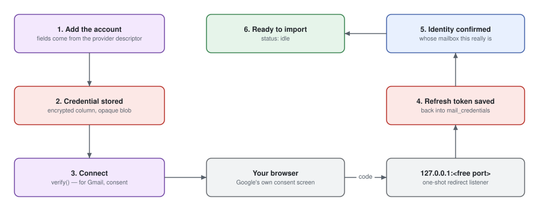

# Connecting a mailbox

An account is a mailbox this archive imports from. It has a provider, an
address, a credential that opens it, and a status.



## Which mailboxes work today

| Provider | State |
| --- | --- |
| **Folder of `.eml` files** | Works. Anything you exported from Thunderbird, `mbox` split into files, a maildir. |
| **Gmail** | Built and tested, but not yet registered — see below. |
| IMAP (iCloud, Gmail app passwords) | Planned |
| Microsoft 365 | Planned |

The account form is generated from what the provider *declares* it needs, not
from hand-written fields, so a provider gaining an implementation gains its form
for free.

## A folder of `.eml` files

This is a real provider, not a test double. The credential *is* the directory
path:

1. Put the `.eml` files in one directory.
2. Add an account, pick **Folder of .eml files**, and give it that path.
3. Connect. A path that is not there fails the same way a rejected password
   would — as an authentication error, with the reason.

Files are listed in sorted order and paged, so an import over them exercises
the same cursor logic a real provider does.

## Gmail

> The Gmail adapter is complete — consent, token refresh, listing, and fetching
> raw messages — but `GmailSource` is not yet registered in
> `app/composition.py`, so Gmail does not appear in the account form. Until that
> one line lands, everything below is the setup you will need rather than
> something you can do in the UI today.

### You bring your own OAuth client

This application ships **no** client secret. The quota, the consent screen and
the audit trail belong to whoever runs it — you. That means a Google Cloud
project of your own:

1. Open the [Google Cloud console](https://console.cloud.google.com) and create
   a project (or pick one).
2. **APIs & Services → Library** → enable the **Gmail API**.
3. **APIs & Services → OAuth consent screen** → *External*, unless you have a
   Workspace tenant. Add yourself as a test user.
4. **Credentials → Create credentials → OAuth client ID** → application type
   **Desktop app**.
5. Copy the **client ID** and **client secret**.

You do not register a redirect URI. Google accepts any loopback port for a
desktop client, which is exactly what the consent flow uses.

### The one scope it asks for

```text
https://www.googleapis.com/auth/gmail.readonly
```

That is the whole list. An archive only ever reads, and asking for more would
put a capability on the consent screen that no code here can use.

### What the consent round trip does

Pressing **Connect** on a Gmail account:

1. Starts a throwaway HTTP server on `localhost`, on a port the OS picks. It
   waits at most `app.google.consent_timeout` seconds (default 300) and is
   gone afterwards whatever happened.
2. Opens your browser at Google's consent screen, preselecting the address you
   typed (`login_hint`). You sign in as yourself — this application never sees
   your password, which is the entire point of OAuth.
3. Google redirects back to that loopback port with a one-time code.
4. The code is exchanged for an access token **and a refresh token**
   (`access_type=offline`, `prompt=consent`). Google's consent page lets you
   untick the Gmail permission; a grant without it is refused on the spot
   rather than stored.
5. The account is asked whose mailbox it actually is, and the answer has to
   match the address you typed. If you consented as a different account — easy
   with several Google sessions in one browser — the grant is discarded, the
   account goes to `auth_error`, and the message names both addresses.

The refresh token is what lets an import run unattended later. Without one, an
access token dies within the hour and the account can never sync again on its
own.

::: warning While the Google project is in "Testing"
Google shows a *"Google hasn't verified this app"* page first. If pressing
**Continue** there ends on *"An error occurred"* (`/info/unknownerror`),
switch the page's language once with the dropdown at the bottom left and press
Continue again. The first render of that page is a known Google defect; the
consent itself is fine. Grants made in Testing status expire after seven days
and then ask for a reconnect.
:::

## How the credential is stored

`mail_credentials.secret` is a single encrypted column, and its contents are
deliberately structureless: each provider serialises its own model into it —
Gmail its client id, client secret and refresh token; IMAP a host and a
password. That is why adding a provider needs no schema migration.

The column is encrypted at rest with the Fernet key from `mn-db-encryption-key`.
Lose that key and every stored credential becomes unreadable; the archive itself
survives, but every account has to be reconnected.

## Account status

| Status | What it means | What to do |
| --- | --- | --- |
| `idle` | Connected, nothing running | Start an import |
| `syncing` | A job is walking the mailbox | Watch, or cancel |
| `auth_error` | Credentials rejected or revoked | Reconnect — retrying will not help |
| `error` | Something else went wrong | Read `last_error` |

`auth_error` is the one the UI acts on differently: it offers a reconnect
rather than a retry, because no amount of retrying fixes a revoked token.

`enabled` is your switch; `status` is the machine's report. Disabling an account
keeps whatever status its last run left behind.

## Next

[Importing mail](importing-mail.md).
