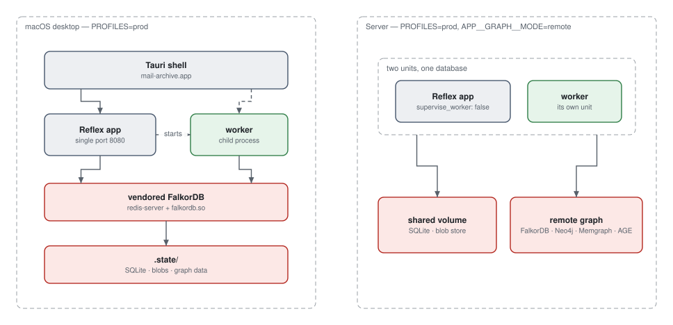

# The desktop app

A macOS `.app` that carries its own graph database, so the machine it runs on
needs no Homebrew, no Docker, no Redis and no `uv`.

That is not gold-plating. A GUI launch inherits launchd's `PATH` —
`/usr/bin:/bin:/usr/sbin:/sbin` — which has no developer toolchain in it at all.
Anything the app needs has to travel with it, or it is not there.



## Building it

Build-machine requirements, on top of `uv` and `task`: Xcode command line
tools, Rust, Node, and Homebrew `openssl@3`.

```sh
task tauri:init      # check the toolchain, install tauri-cli, generate icons
task tauri:vendor    # download and build the vendored runtimes
task tauri:dev       # run the desktop app against this checkout
task tauri:build     # produce build/release/bundle/macos/mail-archive.app
```

`task tauri:build` also runs `task tauri:frontend`, which compiles the Reflex
frontend up front — otherwise the app's first launch spends several seconds on a
cold `reflex init`.

## What `task tauri:vendor` produces

| File | Where it comes from |
| --- | --- |
| `redis-server` | Built from pinned Redis source with `BUILD_TLS=no`, so it links only system libraries |
| `falkordb.so` | The pinned official FalkorDB release asset, SHA256-verified |
| `libssl.3.dylib`, `libcrypto.3.dylib` | Copied from Homebrew — the FalkorDB module links them at absolute paths |
| `uv` | The pinned official release binary, SHA256-verified |

Every rewritten Mach-O is re-signed. Editing a Mach-O invalidates its signature,
and arm64 macOS refuses to load unsigned code — so a rewrite without a re-sign
produces a bundle that fails at launch with nothing useful in the log.

The vendoring run ends by re-reading the load commands and failing if anything
still points outside `@loader_path`, `/usr/lib` or `/System`:

```sh
task tauri:vendor:verify
```

### Prove it is really self-contained

The build machine has Homebrew, and Homebrew will happily mask a broken bundle
by satisfying a dylib the app should have carried. To check honestly:

```sh
brew unlink openssl@3
open build/release/bundle/macos/mail-archive.app
```

If it starts, the bundle is genuinely standing on its own.

## What it is not

**The Python backend still runs from this checkout**, launched through the
vendored `uv`. Only FalkorDB is fully vendored. Freezing the backend into the
bundle is stubbed out — see [`src-tauri/src/sidecar.rs`](https://github.com/jenreh/mail-archive/blob/main/src-tauri/src/sidecar.rs)
and `task tauri:bundle:sidecar`.

So the built `.app` is self-contained *with respect to its runtimes*, and not
yet with respect to its own source. Moving it to a machine without this
repository will not work.

## Where it keeps your mail

A release launch runs the code out of this checkout but keeps **no data** in
it. Before the backend exists to race it, the Tauri shell creates the per-user
application data directory and points the backend at it:

```text
~/Library/Application Support/de.rehpoehler.mailarc/
├── mail-archive.db      mailboxes, credentials, jobs, checkpoints
├── mailstore/           the original bytes — this is the archive
└── falkordb/            the graph's data
```

The path comes from the bundle identifier in `tauri.conf.json`
(`de.rehpoehler.mailarc`) through Tauri's own path resolver, so it moves with
the identifier and nothing else has to know it.

The directory is then `chmod`-ed to `0700` — an explicit chmod rather than a
creation mode, because a permissive umask, or a directory an earlier version
left behind, must not leave somebody's mail readable to every account on the
Mac. The database file's directory, the blob store's root and the graph's data
directory each do the same again on the Python side, so every level is private
whichever of the two created it.

The three settings arrive as environment variables, and the first one is the
trap worth remembering:

| Variable | Value |
| --- | --- |
| `app_database_url_override` | `sqlite+aiosqlite:///<dir>/mail-archive.db` |
| `app_archive_store_dir` | `<dir>/mailstore` |
| `app_graph_data_dir` | `<dir>/falkordb` |

It is **`app_database_url_override`**, not `app_database_url`.
`DatabaseConfig.url` is a computed field over a stored override, so the obvious
name is accepted and silently ignored — which puts the app straight back on
`config.yaml`'s `.state/mail-archive.db`.

`task tauri:dev`, `task run` and every other development run set none of the
three and keep their data in the checkout's `.state/`, unchanged. The built app
and the checkout therefore never share an archive, which is the point — and
also why mail you imported while developing is not in the bundled app.

One directory either way: quit the app and copy it, and you have copied the
archive. See [backup and restore](../developer/operations.md#backup-and-restore)
for what in it is genuinely irreplaceable.

## What runs when you launch it

1. The Tauri shell starts.
2. It prepares the per-user data directory above — release builds only; a debug
   run leaves the backend on `.state/`.
3. It launches the Reflex backend through the vendored `uv`, with
   `PROFILES=prod` — a single port, 8080, because Reflex refuses to start in
   production mode when the frontend and backend ports differ.
4. The application's ASGI lifespan starts the vendored FalkorDB from
   `src-tauri/resources/falkordb`, pointed at the `falkordb/` directory inside
   whichever data directory step 2 settled on.
5. The same lifespan starts the import worker as a child process.
6. The window loads the frontend on the search page.

If FalkorDB is already serving on the port, the app **adopts** it rather than
starting a competitor — and on shutdown it leaves an adopted server running,
because it did not start it.

A failed start of either the graph or the worker is logged and swallowed, not
fatal. The page whose whole job is reporting server state is more useful up than
down, and it shows the reason.

## Other tasks

```sh
task tauri:falkor           # start only FalkorDB, to poke at with redis-cli
task tauri:backend          # run just the backend, exactly as the shell does
task tauri:vendor:force     # re-download and rebuild every runtime
task tauri:clean            # remove build output and the vendored runtime
```
