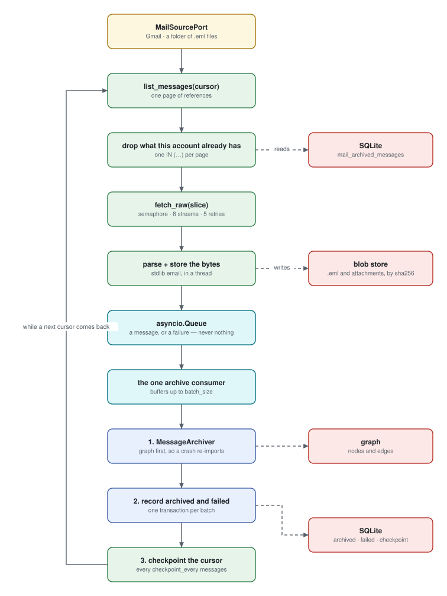

# Importing mail

## What an import does

It walks the mailbox one page at a time. For every message it has not seen
before it fetches the original RFC 5322 bytes, writes those bytes to disk under
their sha256, parses them, and writes the result into the graph.



The first import of a large mailbox is tens of thousands of HTTP requests and
takes hours. It is built to survive that: the laptop lid can close, the process
can be killed, the provider can rate-limit — and the next run picks up where the
last one stopped.

## Starting one

An import is a **job**. Something enqueues it, a worker claims it, and the job
row is what you watch.

The worker runs as a child of the web application by default. Where you want it
on its own — under Docker, systemd, or just to watch its log:

```sh
task sync:worker
```

Set `sync.supervise_worker: false` in that case, or the application starts a
second one and the two race for the same jobs.

## Reading the progress

A job carries four numbers, and they are deliberately not collapsed into one:

| Number | Meaning |
| --- | --- |
| `listed` | The provider offered this message |
| `skipped` | We already had it — no fetch, no write |
| `archived` | It reached the graph |
| `failed` | It did not, and there is a row saying why |

The progress bar counts `archived + skipped` as done, because that is how much
of the mailbox has been dealt with. `failed` is tracked separately on purpose:
folding it into "archived" would make a broken mailbox look like a small one.

`estimated_total` is the provider's own guess. It is allowed to be wrong, and on
Gmail it usually is by a little.

## Cancelling

A job is **asked** to stop, never killed. The request is read between two
batches, so a cancel takes effect once the batch in flight has been written —
typically within a page. Nothing is left half-written, and the checkpoint is
current, so resuming continues from there.

## Resuming, and what a crash costs

Two mechanisms, doing different jobs.

**The checkpoint** stores the provider's cursor every ~200 messages. A crash
costs at most that many messages of *listing* work.

**The archived-message ledger** remembers every provider id already written. So
even the messages between the last checkpoint and the crash are not re-fetched
— the next run lists them, recognises them, and skips them.

The two orders in the write path are chosen for this:

- The graph is written **before** the ledger. A crash between them leaves a
  message archived but not noted, so the next run archives it again — which is
  free, because the writer is idempotent. The other order would lose the message
  for good.
- The checkpoint advances **after** everything before it is archived. It never
  points past work that did not land.

## Importing the same mailbox twice

Costs one listing pass and writes nothing.

A message's identity comes from the message, not from the provider: its RFC 5322
`Message-ID` where there is one, and a content hash over
`sent_at | from | subject | sha256(body)` where the sender omitted it. So the
same mail arriving through two of your accounts is **one** `Message` node with
two `ARCHIVED_FROM` edges — not two copies.

The same holds for everything the message points at. One `Address` node per
address, one `Attachment` node per file content (twenty messages carrying the
same PDF share one node, and the filename hangs on the edge, because senders
rename things).

## Clearing a mailbox

**Clear** on the accounts page deletes everything a mailbox has imported and
leaves the mailbox itself alone. It is the way to import an account again from
the beginning — after a provider was set up wrongly, after a folder filter
changed, or when the archive for that account is simply not what you wanted.

It is not **Delete**. The mailbox keeps its name, its address and the
credential that opens it, and it stays in the list; only its mail goes. Press
**Import** afterwards and the full walk starts from nothing, because clearing
also forgets the two things that would otherwise make a second import a no-op:

* the ledger of provider ids this account has already archived — the table the
  import subtracts from every listing batch *before* it fetches anything, so an
  archive emptied without it re-imports nothing at all and reports success;
* the sync checkpoints, both the full walk's page token and the incremental
  watermark.

The dialog asks first, and it names the mailbox it is about to empty.

### Mail two mailboxes hold stays

The section above says the same mail arriving through two of your accounts is
one `Message` node with two `ARCHIVED_FROM` edges. Clearing one of those
accounts takes its edge and **not** the message: the other account's copy is
still mail you have, and it stays readable with its sender and its
attachments. The count that comes back after a clear-out says how many such
messages stayed, and it is worth reading — a mailbox that reports several
thousand and clears three is a mailbox where something else is wrong.

### What is not deleted

`Address` nodes survive, which is what keeps "always show pictures from this
sender" alive across a re-import — that decision is about the address, not
about which mailbox the mail arrived in. The original bytes stay in the blob
store as well: it is content-addressed and write-once, so a re-imported message
finds its own blob already there, and proving that no other message references
the same bytes is not something worth getting wrong.

The derived layer (groups, topics, templates) is disposable by construction:
whatever hung off a deleted message goes with it, and the next **Rebuild** on
the insights page recomputes the rest.

### While an import is running

Clearing is refused while a job is running *or queued* against that mailbox,
and the page says so. A queued import starts the moment a worker frees up,
which mid clear-out would leave a graph and a ledger that disagree. Let it
finish, or cancel it, then clear.

## When a message is skipped

Some messages will not parse — broken MIME, a truncated multipart, a 404 from
the provider. Those are skipped, and **every skip leaves a row** in
`mail_failed_messages` with the provider's id, a reason and the detail.

There is no silent failure anywhere in the import. A skipped message is a
countable event, not a gap.

## When the provider pushes back

A rate limit or a 5xx is treated as "the same call may work". The engine backs
off exponentially — 1s, 2s, 4s, … capped at 60s, with jitter added upward so a
hundred slices that failed together do not all return at the same instant. If
the provider sent a `Retry-After`, that is a floor the engine will not undercut.

After five attempts on the same slice, the engine gives up. That is not a
hiccup, it is an outage, and a run that waits it out would hold a lease it
cannot honour. The job fails, goes back in the queue, and a later run resumes at
the checkpoint.

An **authentication** failure is different: it ends the job immediately and puts
the account into `auth_error`. Retrying a revoked token never works.

## What the graph ends up holding


Everything above is read out of the message or computed from it
deterministically, so re-parsing the same bytes gives the same node. Nothing is
guessed.

The graph keeps a capped rendering of the body — 64 KB by default, enough for
full-text search. The whole message stays in the blob store, so a longer body is
never lost, only unindexed past that point. A parser fix can be replayed over
the entire archive from those bytes without asking the provider for anything
twice.

## Looking at what arrived

**Search** — the page the window opens on, at `/` — is where you look at what
arrived. Opened with no question in it, it lists the whole archive newest
first, which is what you want right after an import; filling in a sender, a
recipient, a date range or the words in a message narrows that list. Under a
row's preview sit the labels the provider filed the message under — your own
labels in blue, folders in teal, the provider's housekeeping (Inbox, Updates,
Unread) in grey and last. Pick a message and the reading pane beside the list
shows it in two tabs:

- **Message** — the way a mail client renders it: subject, From / To / Cc /
  Date, the attached files with their sizes, and the body. An HTML mail keeps
  its layout and its inline pictures; a plain-text mail shows as text.
- **Source** — the **raw bytes** the provider handed over, headers and all,
  read back from the blob store.

A few things are on purpose:

- The list is read from the graph, the original from disk; nothing is fetched
  from the provider. What you see is what the import wrote.
- The rendered body sits in a sandboxed frame that may load **nothing
  remote** by default — no scripts, no tracking pixels, no fonts from a
  stranger's server — the same default a mail client ships with. Only the
  pictures the mail itself carries are shown. When a message wants remote
  content, a bar above the body says so and offers two choices: **Allow
  once** opens this one rendering, **Allow for this sender** records the
  decision on the sender's address in the graph, so every later message from
  that exact address opens with its pictures. Scripts stay blocked either
  way — trust extends to being seen, never to being run.
- The list brings in a page of messages at a time; **Load more** at the bottom
  appends the next one. The count above the list says how far you are.
- A very large source is cut after the first 256 KB, with a note. The rest is
  still on disk; the viewer just declines to render a PDF as base64.
- A message archived without a stored original — or whose blob has since
  gone missing — says so instead of erroring.

The page reads **every mailbox of the installation** at once, and nothing in
the application narrows that. There is no sign-in and no per-mailbox
permission: this is a desktop archive, and the boundary is whoever can open the
window — the same boundary as the files on disk. Do not run it where that is
not what you want.

## Checking what the analyses made of it

**Insights** in the rail (`/insights`) is the other half: the search page shows
what the import wrote, this one shows what was *derived* from it — who gets
addressed together, which of those groups recur, what the mail is about, and
which of it is written by a machine.

Nothing is derived until you ask. **Rebuild** queues the work as a job and the
bar under it climbs in stages, so the page stays usable while a large archive is
read; **Cancel** stops it at the next stage boundary. A rebuild throws the whole
derived layer away and computes it again, which means running it twice over an
unchanged archive changes nothing, and a cancelled one costs only the stages it
had reached.

The panel worth reading first is the **cross-check**, and it is the reason this
page exists rather than a report. Who is addressed together is the one finding
that can be worked out two ways: from the stored edge a rebuild wrote, and from
the messages themselves, counted again from scratch. The page asks both and
holds the answers against each other:

- **Teal** — the two agree on every pair the check could rule on.
- **Yellow** — the messages count *more* than the edge does. Usually harmless:
  no rebuild since the last import, a rebuild capped by configuration, or
  messages sent to more people than the analysis is set to consider.
- **Red** — the edge claims **more** than the messages support, or names a pair
  the messages never produced. Nothing legitimate does that; a red verdict means
  the number is wrong, not that it is stale.

Under the verdict sit the heaviest pairs they disagree on, both numbers side by
side and a dash where one side never named the pair at all — so a wrong count
can be looked up in the archive rather than argued about. The line beside the
verdict says how many pairs it actually ruled on: only the busiest are compared,
and a pair below where the other list was cut proves nothing either way.

The rest is what was found: recurring groups with their size and message count,
topics with the **method** that produced each one — a badge, because `ref` is a
fact read out of a header while the others are a suggestion — and templates
split into what you send and what you receive, since only the mail you write
yourself can be automated.

The same caveat applies here more sharply than anywhere else: a co-recipient
listing says who writes to whom across every mailbox in the installation, and
nothing gates it.

## Job kinds

| Kind | State |
| --- | --- |
| `import` | Works — a full walk of a mailbox |
| `derive` | Works — recomputes the analysis nodes. **Rebuild** on the insights page enqueues one; `task graph:rebuild-derived` does the same without a worker |
| `incremental` | Works — Gmail's `historyId` delta, queued by the interval schedule (see [Configuration](./configuration.md)). Falls back to a full walk in the same job when the cursor is too old |
| `embed` | Works — computes the message embeddings semantic search needs. Needs an embedder configured (see [Semantic search](./semantic-search.md)). **Rebuild the vectors** on the embedder page enqueues one; `task graph:embed` runs the same job without a worker |

Every kind has a handler. A kind without one would fail its job with "no handler
registered", which is what the worker does with an unmapped kind; the next kind
to be added fails a test before it can fail a job.

The schedule only queues `incremental` for a mailbox whose **first full import
has finished**. There is no history before that point, so a delta over a fresh
account would archive nothing and report success for ever. Press **Import**
once; from then on the schedule keeps up.
